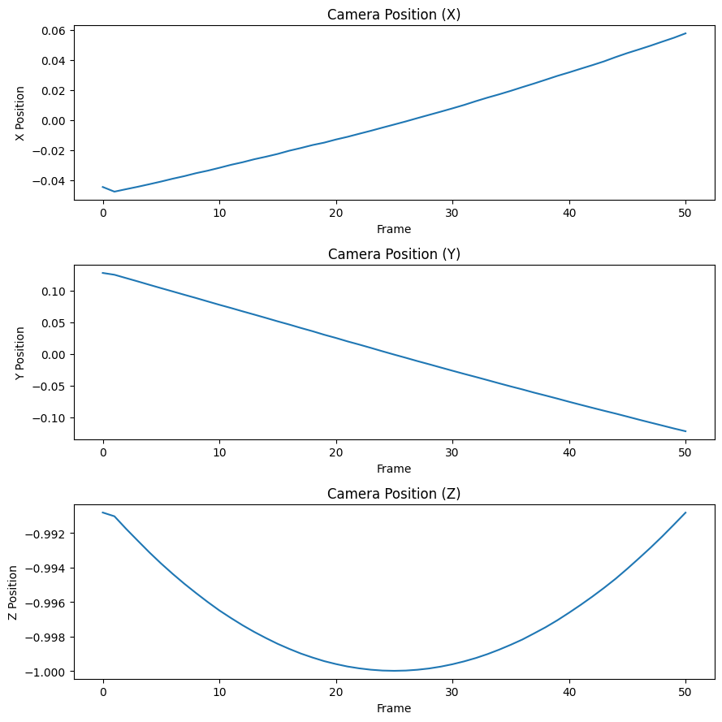

# Affine Structure from Motion

This repository contains an implementation of the Affine Structure from Motion algorithm, which recovers a 3D point cloud from a sequence of images.

## Overview

Affine Structure from Motion (SfM) is a computer vision technique that reconstructs 3D information from 2D image sequences. This implementation:

1. Takes tracked 2D points across multiple frames as input
2. Creates a measurement matrix by normalizing the points
3. Applies singular value decomposition (SVD) to factorize the matrix
4. Enforces orthographic constraints to obtain 3D structure
5. Provides visualization tools for the reconstructed 3D point cloud and camera positions

## Example Results

### 3D Reconstruction


The algorithm reconstructs the 3D structure of a scene (red points) from 2D point correspondences tracked across multiple frames. The blue line shows the camera path, with green triangle marking the start position and black circle marking the end position.

### Camera Motion Analysis



The individual X, Y, and Z coordinates of the camera position over time show how the camera moves throughout the sequence:
- X position increases linearly (camera moving right)
- Y position decreases linearly (camera moving down)
- Z position follows a parabolic trajectory (camera first moving away then closer)

## Usage

```python
# Load your track data
import numpy as np
from sfm import affineSFM, plot_X, plot_cam_pos

# Example with tracked points from multiple frames
track_x = your_x_coordinates  # Shape: (num_frames, num_points)
track_y = your_y_coordinates  # Shape: (num_frames, num_points)

# Remove rows with NaN values
is_nan = np.isnan(track_x) | np.isnan(track_y)
is_valid = ~is_nan
valid_row_indices = is_valid.all(axis=1)
track_x, track_y = track_x[valid_row_indices], track_y[valid_row_indices]

# Run SfM algorithm
A, X = affineSFM(track_x, track_y)

# Visualize results
plot_X(X)  # Plot 3D point cloud
plot_cam_pos(A)  # Plot camera positions
```

## Requirements

- Python 3.x
- NumPy
- Matplotlib
- SciPy (for loading .mat files)

## Setup with Conda

```bash
# Create a new conda environment named "sfm" with Python 3.10
conda create -n sfm python=3.10

# Activate the environment
conda activate sfm

# Install required packages
conda install -c conda-forge numpy scipy matplotlib jupyter

# Register the environment with Jupyter
python -m ipykernel install --user --name=sfm --display-name="Python (SfM)"
```

If the kernel doesn't appear in Jupyter, try:
```bash
# Make sure ipykernel is installed
conda install -c conda-forge ipykernel

# Register the kernel again
python -m ipykernel install --user --name=sfm --display-name="Python (SfM)"

# Restart Jupyter
```

## Implementation Details

The implementation follows these key steps:

1. **Measurement Matrix Creation**: Normalizes track points to zero mean and creates the measurement matrix
2. **Matrix Factorization**: Uses SVD to decompose the measurement matrix and enforces rank 3 constraint
3. **Orthographic Constraint Application**: Solves for the appropriate transformation matrix
4. **Structure Reconstruction**: Recovers the 3D coordinates and camera motion

## Visualization Code Examples

### 3D Point Cloud and Camera Path

```python
# Get camera positions
cam_pos = get_cam_pos(A)

# Plot 3D points and camera path
fig = plt.figure(figsize=(12, 10))
ax = fig.add_subplot(projection='3d')

# Plot 3D points
xs, ys, zs = X
ax.scatter(xs, ys, zs, color='r', s=10, alpha=0.5, label='3D Points')

# Plot camera path
ax.plot(cam_pos[:, 0], cam_pos[:, 1], cam_pos[:, 2], 'b-', linewidth=2, label='Camera Path')
ax.scatter(cam_pos[:, 0], cam_pos[:, 1], cam_pos[:, 2], color='blue', s=30)

# Mark start and end of camera path
ax.scatter(cam_pos[0, 0], cam_pos[0, 1], cam_pos[0, 2], color='green', s=100, marker='^', label='Start')
ax.scatter(cam_pos[-1, 0], cam_pos[-1, 1], cam_pos[-1, 2], color='black', s=100, marker='o', label='End')

ax.set_xlabel('X')
ax.set_ylabel('Y')
ax.set_zlabel('Z')
ax.set_title('3D Point Cloud and Camera Path')
ax.legend()
```

### Camera Position Plots

```python
# Plot camera positions over time
cam_pos = get_cam_pos(A)
plt.figure(figsize=(12, 9))

plt.subplot(3, 1, 1)
plt.plot(cam_pos[:, 0])
plt.xlabel('Frame')
plt.ylabel('X Position')
plt.title('Camera Position (X)')

plt.subplot(3, 1, 2)
plt.plot(cam_pos[:, 1])
plt.xlabel('Frame')
plt.ylabel('Y Position')
plt.title('Camera Position (Y)')

plt.subplot(3, 1, 3)
plt.plot(cam_pos[:, 2])
plt.xlabel('Frame')
plt.ylabel('Z Position')
plt.title('Camera Position (Z)')

plt.tight_layout()
```

## License

MIT License